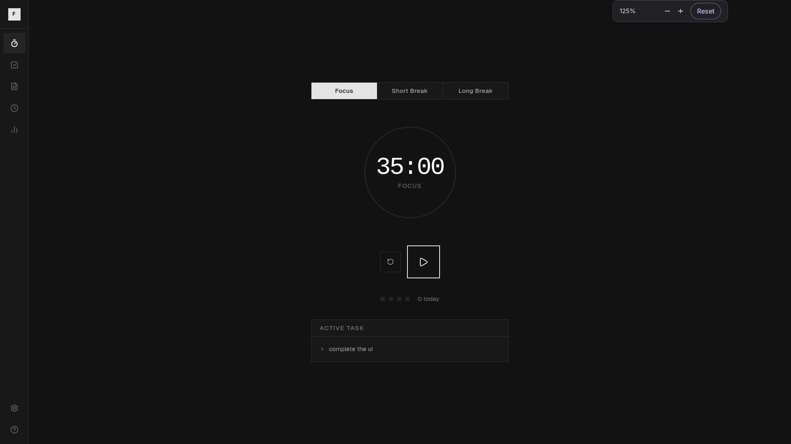

# Special Clocks

A minimal clock app with multiple layouts, timezone support, and smooth theme switching.

---



---

## Features

- **2 clock layouts** — Minimal typographic and Retro terminal
- **Dark / light mode** — per-layout color palette, transitions smoothly
- **Fullscreen** — native browser fullscreen with one click
- **Timezone picker** — searchable list of 60+ cities, persisted to localStorage
- **Everything persisted** — theme, layout, and timezone survive page refresh

---

## Getting started

```bash
git clone <repo-url>
cd special-clocks
npm install
npm run dev
```

Open [http://localhost:3000](http://localhost:3000).

---

## Adding a new layout

1. Create `src/components/clocks/ClockYourName.tsx` — it receives a `ClockData` prop and uses `var(--ck-*)` CSS variables for colors.
2. Add two CSS blocks in `src/app/globals.css`:

```css
[data-theme="dark"][data-clock="yourname"] {
  --ck-bg: /* ... */;
  --ck-text: /* ... */;
  --ck-muted: /* ... */;
  --ck-surface: /* ... */;
  --ck-border: /* ... */;
  --ck-icon: /* ... */;
  --ck-icon-hover: /* ... */;
  --ck-scan: transparent;
}

[data-theme="light"][data-clock="yourname"] { /* ... */ }
```

3. Register it in `src/app/page.tsx` (`CLOCK_COMPONENTS`) and `src/components/LayoutDrawer.tsx` (`LAYOUTS` + `PREVIEW_VARS`).

That's it — timezone label, date, day, month, and year are all provided via `ClockData` from outside the layout, so you never have to fetch time inside a component.

---

## Tech stack

- [Next.js](https://nextjs.org/) + [React](https://react.dev/)
- [Framer Motion](https://www.framer.com/motion/) — animations
- [Tailwind CSS](https://tailwindcss.com/) — utilities
- [Lucide](https://lucide.dev/) — icons
